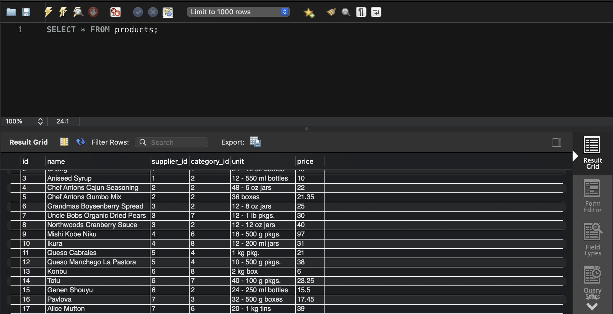
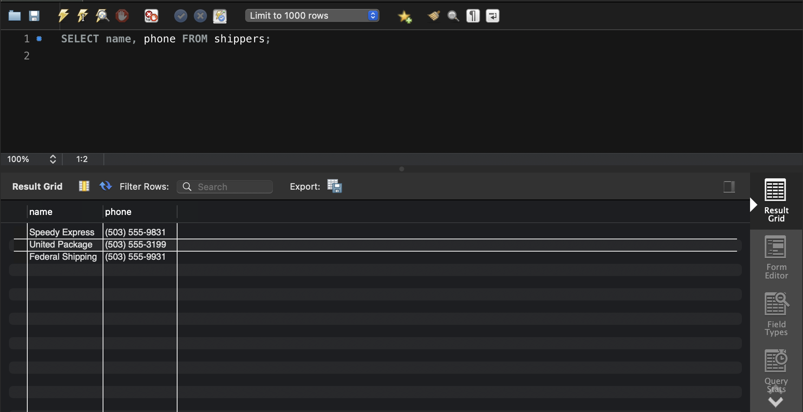
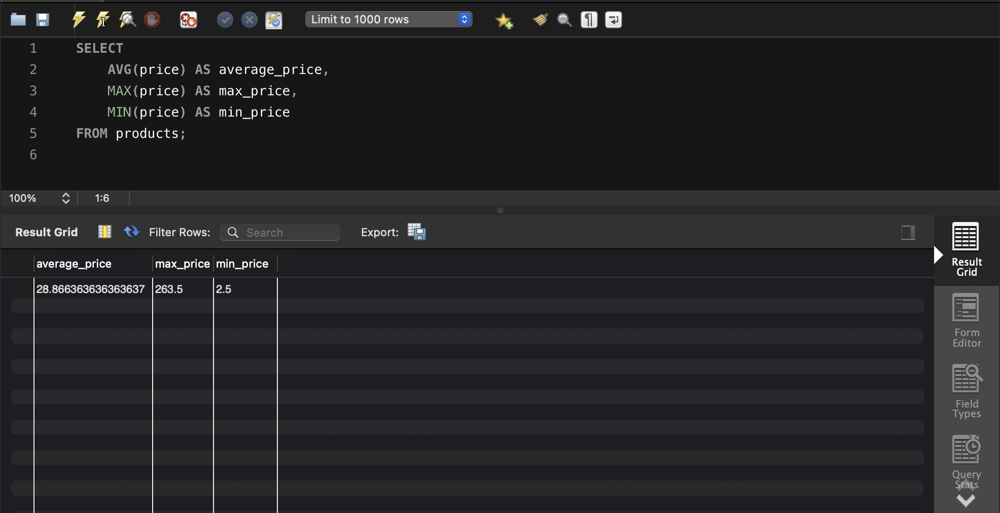
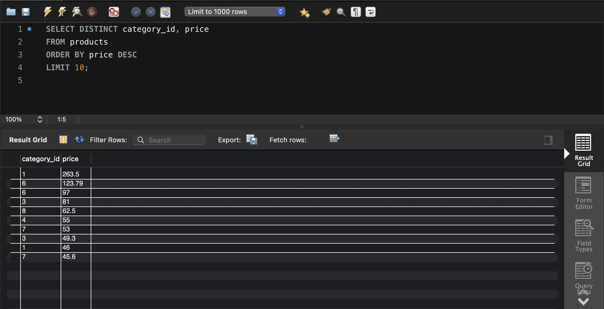
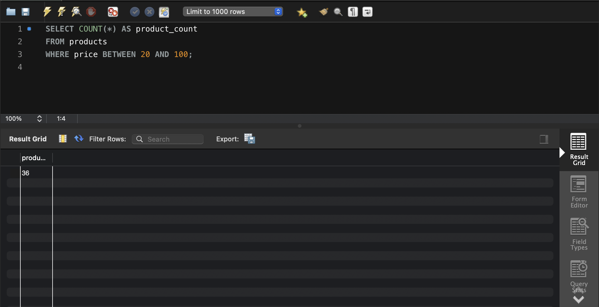
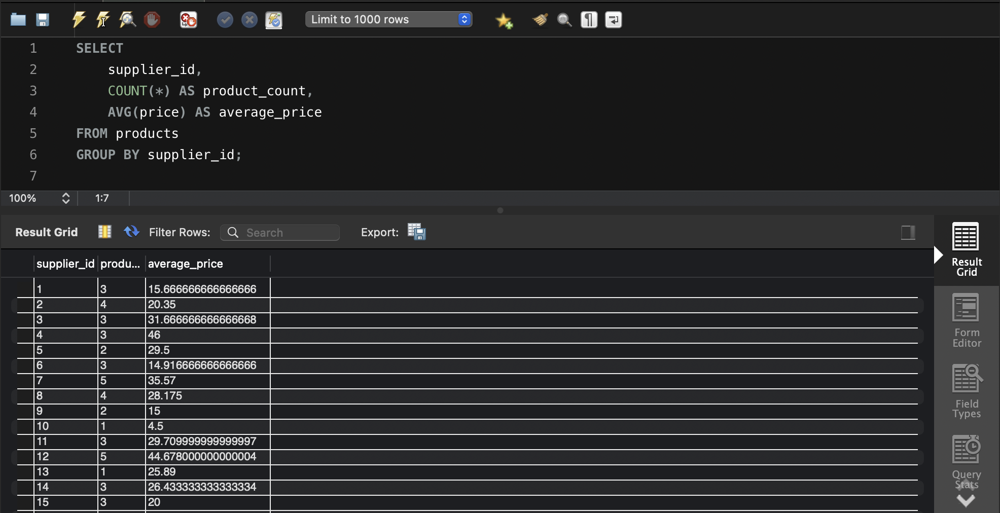

### Завдання 1

1. Вибрати всі стовпчики з таблиці products:
```sql
`SELECT * FROM products;`
```


2. Вибрати тільки стовпчики name та phone з таблиці shippers:
```sql
SELECT name, phone FROM shippers;
```


### Завдання 2
```sql
SELECT 
    AVG(price) AS average_price,
    MAX(price) AS max_price,
    MIN(price) AS min_price
FROM products;
```


### Завдання 3
```sql
SELECT DISTINCT category_id, price
FROM products
ORDER BY price DESC
LIMIT 10;
```


### Завдання 4
```sql
SELECT COUNT(*) AS product_count
FROM products
WHERE price BETWEEN 20 AND 100;
```


### Завдання 5
```sql
SELECT 
    supplier_id,
    COUNT(*) AS product_count,
    AVG(price) AS average_price
FROM products
GROUP BY supplier_id;
```

